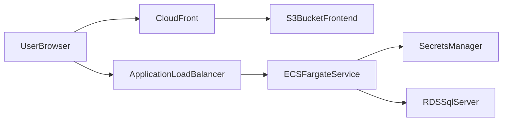

# AWS Target Architecture

## Services

- **VPC** with two public and two private subnets.
- **ALB** in public subnets for HTTPS ingress.
- **ECS Fargate** service in private subnets for the Node API container.
- **Amazon RDS for SQL Server** in private subnets.
- **S3 + CloudFront** for frontend hosting (`client/dist` artifacts).
- **Secrets Manager** for database and app secrets.
- **CloudWatch** for logs and alarms.

## Security Defaults

- RDS `publicly_accessible = false`.
- Security group least-privilege:
  - ALB accepts `80/443` from internet.
  - ECS accepts `3001` only from ALB security group.
  - RDS accepts `1433` only from ECS security group.
- Storage encryption enabled on RDS.
- Deletion protection enabled by default on database.
- Secrets are not stored in git; runtime values come from Secrets Manager.

## Data Flow

## Deployment Topology

- A single ECS service is enough for initial migration to preserve session behavior.
- After stabilization, move sessions to Redis/ElastiCache and scale ECS horizontally.
- Use ACM certificate on ALB and CloudFront custom domain for TLS termination.

## Artifact Locations

- Terraform baseline: `infra/terraform`
- Runtime container image build: `Dockerfile`
- Migration runbook: `docs/aws-db-migration-runbook.md`
